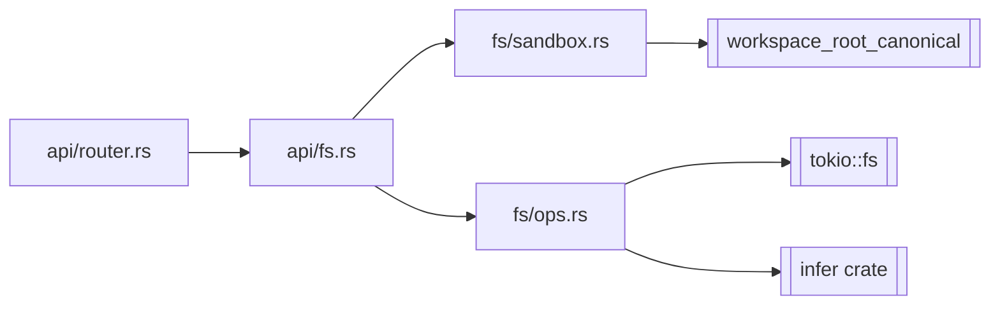

# Phase 01 — Server FS foundation

## Context links

- Parent: [plan.md](./plan.md)
- Scout: `plans/260407-1815-ide-file-explorer/scout/scout-01-codebase.md`
- Researcher: `plans/260407-1815-ide-file-explorer/research/researcher-01-server-fs.md`
- Depends on: none. First phase.

## Overview

Date: 2026-04-07. Build the sandbox helper, `FsError`, and `fs::ops` module (read/list/stat/metadata). Wire read-only REST routes `/api/fs/list`, `/api/fs/read`, `/api/fs/stat` behind feature flag. No watcher, no WS, no web. Tests with `tempfile` covering symlink escape.

Priority: P2. Implementation: done (2026-04-08). Review: approved.

## Key Insights

- Path validation must canonicalize then prefix-check `workspace_root` (researcher §2). Reject post-canonicalize symlink escapes.
- Cross-platform canonicalize via `dunce::canonicalize` — strips Windows `\\?\` verbatim prefix, no-op on Linux/macOS. Windows supported from day one (validated 2026-04-08).
- Binary detection layered: `infer::get` → NUL byte → utf8 fail. Cap probe at 8 KB.
- `FsSubsystem` introduced as struct now even though watcher comes in Phase 02 — it owns `workspace_root_canonical` cache.
- Feature flag gate at router level: when off, fs routes return 404 (not registered).
- All ops use `tokio::fs` async; canonicalize via `tokio::fs::canonicalize`.

## Requirements

**Functional**
- `GET /api/fs/list?project=NAME&path=REL` → `{entries: [{name, kind, size, mtime, is_symlink}]}`
- `GET /api/fs/read?project=NAME&path=REL[&offset=N&len=M]` → text body or JSON `{binary:true, mime}` for binary
- `GET /api/fs/stat?project=NAME&path=REL` → `{kind, size, mtime, mime, is_binary}`
- Path resolution: `project_path(project)` from existing `workspace.rs` + relative `path`, validated by sandbox helper.
- Feature flag `features.ide_explorer` in `dev-hub.toml` `[features]` table; env override `DEV_HUB_IDE=1`.

**Non-functional**
- All errors map to typed HTTP status (400 / 403 / 404 / 413 / 500).
- Read cap: refuse > 100 MB single read without offset/len.
- Tests: ≥9 covering happy path, escape, symlink in/out, binary detect, large file refuse, missing project, Windows backslash normalize, Windows verbatim-prefix strip, Windows drive-letter case (last three `#[cfg(windows)]`).
- CI: add `windows-latest` runner to server test matrix.

## Architecture



## Related code files

**Add**
- `server/src/fs/mod.rs` — module root, `FsSubsystem` struct stub
- `server/src/fs/sandbox.rs` — `validate_fs_path`, `WorkspaceSandbox`
- `server/src/fs/ops.rs` — `read_file`, `list_dir`, `stat`, `detect_binary`
- `server/src/fs/error.rs` — `FsError` enum (thiserror)
- `server/src/api/fs.rs` — axum handlers
- `server/tests/fs_sandbox.rs` — integration tests

**Modify**
- `server/Cargo.toml` — add `infer = "0.15"`, `mime_guess = "2"`, `dunce = "1"`
- `server/src/lib.rs` — `pub mod fs;`
- `server/src/api/mod.rs` — `pub mod fs;`
- `server/src/api/router.rs:49` — register fs routes (gated)
- `server/src/state.rs:21` — `pub fs: FsSubsystem`
- `server/src/error.rs` — `Fs(#[from] FsError)` variant + `status_code` mapping
- `server/src/config/mod.rs` — `[features]` table parsing

## Implementation Steps

1. **Cargo deps** — add `infer = "0.15"`, `mime_guess = "2"`, `dunce = "1"` to `server/Cargo.toml`.
2. **Feature flag** — extend `DevHubConfig` in `server/src/config/mod.rs` with `pub features: FeaturesConfig { pub ide_explorer: bool }`. Default false. Env override read in `lib.rs` startup.
3. **FsError** — `server/src/fs/error.rs`:
   ```rust
   #[derive(Debug, thiserror::Error)]
   pub enum FsError {
     #[error("not found")] NotFound,
     #[error("path escape")] PathEscape,
     #[error("permission denied")] PermissionDenied,
     #[error("too large: {0}")] TooLarge(u64),
     #[error("io: {0}")] Io(#[from] std::io::Error),
   }
   impl FsError { pub fn status_code(&self) -> u16 { ... } }
   ```
4. **Sandbox** — `server/src/fs/sandbox.rs`:
   ```rust
   pub struct WorkspaceSandbox { root: PathBuf } // canonicalized
   impl WorkspaceSandbox {
     pub async fn new(root: PathBuf) -> Result<Self, FsError>;
     pub async fn validate(&self, requested: &Path) -> Result<PathBuf, FsError>;
   }
   ```
   `validate`: reject `..` lexically first, then `tokio::task::spawn_blocking(|| dunce::canonicalize(p))` (strips Windows `\\?\` verbatim prefix; no-op on Unix), `starts_with(self.root)` else `PathEscape`. Root canonicalized once at `new()` via same path. Note: `tokio::fs::canonicalize` is NOT used — it returns verbatim paths on Windows that break `starts_with` checks.
5. **Ops** — `server/src/fs/ops.rs` functions:
   - `pub async fn list_dir(abs: &Path) -> Result<Vec<DirEntry>, FsError>` — walks one level, returns name/kind/size/mtime/is_symlink.
   - `pub async fn stat(abs: &Path) -> Result<FileStat, FsError>` — includes `is_binary` via `detect_binary` peek.
   - `pub async fn read_file(abs: &Path, range: Option<(u64,u64)>, max: u64) -> Result<Vec<u8>, FsError>`.
   - `pub async fn detect_binary(abs: &Path) -> Result<(bool, Option<String>), FsError>` — read first 8 KB, run `infer::get` then NUL scan then utf8 check; returns (is_binary, mime).
6. **FsSubsystem** — `server/src/fs/mod.rs`:
   ```rust
   pub struct FsSubsystem { inner: Arc<Mutex<Inner>> }
   struct Inner { sandbox: WorkspaceSandbox /* watcher in phase 2 */ }
   impl FsSubsystem { pub async fn new(ws_root: PathBuf) -> Result<Self, FsError>; }
   ```
   Cheap `Clone` like `PtySessionManager`. NO locks held across awaits — clone sandbox out.
7. **AppState** — add `pub fs: FsSubsystem` to `state.rs`. Construct in `lib.rs` after workspace resolution.
8. **API handlers** — `server/src/api/fs.rs`:
   - `list(State, Query<ListParams>) -> ApiResult<Json<ListResponse>>`
   - `read(State, Query<ReadParams>) -> Response` — sets `Content-Type` from mime, returns body.
   - `stat(State, Query<StatParams>) -> ApiResult<Json<FileStat>>`
   Each: resolve project via existing `workspace::project_path`, join+validate, dispatch.
9. **Router gate** — `api/router.rs:49`: if `config.features.ide_explorer`, register `/api/fs/list`, `/api/fs/read`, `/api/fs/stat` under `protected`.
10. **Error wiring** — `server/src/error.rs`: add `Fs(FsError)` variant; `status_code` matches `FsError::status_code`. `api/error.rs` IntoResponse picks it up.
11. **Tests** — `server/tests/fs_sandbox.rs`:
    - happy path: list workspace, read file
    - escape via `..` lexical
    - escape via symlink pointing outside
    - symlink inside root → allowed
    - binary detect (PNG magic bytes)
    - too-large refuse (synth 200MB sparse file)
    - Windows: backslash separators in request path normalize correctly (`#[cfg(windows)]`)
    - Windows: `\\?\` verbatim prefix stripped by `dunce` so `starts_with(root)` holds (`#[cfg(windows)]`)
    - Windows: drive-letter case preserved after canonicalize (`#[cfg(windows)]`)

## Todo list

- [ ] Add Cargo deps
- [ ] FeaturesConfig + env override
- [ ] FsError + thiserror + status mapping
- [ ] WorkspaceSandbox impl
- [ ] fs::ops module
- [ ] FsSubsystem skeleton
- [ ] AppState wiring
- [ ] api/fs.rs handlers
- [ ] Router gate
- [ ] error.rs ApiError mapping
- [ ] Integration tests (≥6)
- [ ] `cargo test` green; `pnpm check` green

## Success Criteria

- `cargo test` passes; new tests cover all 6 cases above.
- `curl -H "Authorization: Bearer …" /api/fs/list?project=p&path=.` returns JSON entries.
- Symlink escape returns 403.
- Binary file returns 200 with `binary:true` metadata header.
- Feature flag off → 404 on fs routes.

## Risk Assessment

| Risk | Likelihood | Impact | Mitigation |
|---|---|---|---|
| Canonicalize cost on hot list | M | M | cache root once; only validate child path |
| Symlink TOCTOU | L | M | documented; single-user authed |
| `infer` false negative on text-binary | M | L | layered NUL+utf8 fallback |
| Large file OOM via /read | L | H | hard 100 MB cap without range |

## Security Considerations

- All paths flow through `WorkspaceSandbox::validate`. No raw user paths reach `tokio::fs`.
- Reject lexical `..` before canonicalize to short-circuit attacks.
- 100 MB cap on full reads; range required above.
- Audit log hook point added (no-op stub) — populated in Phase 05.

## Next steps

Phase 02 plugs the watcher into `FsSubsystem::Inner` and extends WS protocol with `fs:*` messages. The sandbox + ops module are reused unchanged.
