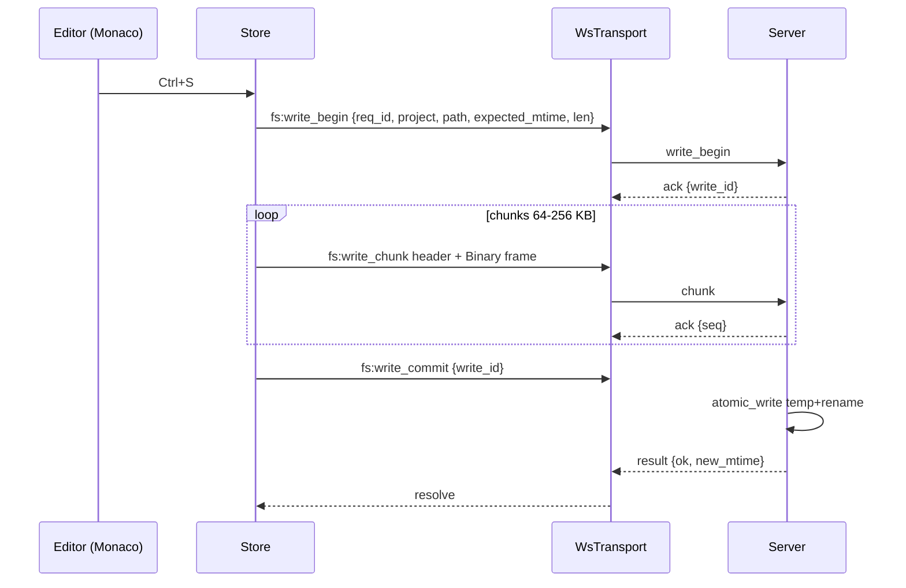

# Phase 04 — Monaco editor + edit/save

## Context links

- Parent: [plan.md](./plan.md)
- Prev: [phase-03-web-ide-shell-readonly.md](./phase-03-web-ide-shell-readonly.md)
- Researcher: `research/researcher-02-web-editor.md` §1, §5, §6
- Server WS protocol: Phase 02

## Overview

Date: 2026-04-07. Replace placeholder with Monaco via `@monaco-editor/react`. Vite worker setup, dynamic import, `manualChunks` split. Zustand tab store with viewState. Ctrl+S save via new `fs:write_*` WS messages. 1MB / 5MB tiering. Binary preview path. Range-read fallback viewer for ≥5MB.

Priority: P2. Implementation: done (2026-04-09). Review: approved.

## Key Insights

- `@monaco-editor/react` loader + `loader.config({ monaco })` to self-host (no CDN).
- Vite worker imports MUST use `?worker` suffix; only ship JSON + TS workers (others lazy).
- `manualChunks: { 'monaco': ['monaco-editor'] }` isolates the ~3MB bundle.
- Save flow: `fs:write_begin` (mtime check) → JSON header + `Binary` frames `fs:write_chunk` → `fs:write_commit` (atomic temp+rename via Phase 01 helper). Server returns new mtime.
- Last-write-wins documented: server checks `expected_mtime`; mismatch returns `Conflict`. UI shows reload-discard prompt.
- Monaco view state (`saveViewState`) persisted on tab blur; restored on focus — preserves cursor + folds + scroll.
- Ctrl+S registered via `editor.addCommand` (Monaco swallows global keydown).
- 5MB+ files: never enter Monaco. Render via `LargeFileViewer` using `fs:read` with `offset/len` and `react-window`.

## Requirements

**Functional**
- Open file from tree → fetches via `fs:read` → opens tab → Monaco loaded.
- Tabs: open, switch, close, dirty indicator, close-confirm if dirty.
- Save: Ctrl/Cmd+S; updates server file atomically; on conflict shows dialog.
- Tiering: <1MB normal Monaco; 1–5MB Monaco degraded (no minimap, no folding); ≥5MB LargeFileViewer.
- Binary files: hex preview (first 4KB) + "open externally" placeholder.
- viewState persisted across tab switches.

**Non-functional**
- Initial JS chunk delta when `/ide` not visited: 0 (lazy boundary).
- Monaco chunk: separate from main; loads on first `/ide` visit.
- Save round trip: < 200 ms for files < 1MB on localhost.

## Architecture



## Related code files

**Add** (placed per atomic tiers — Phase 06)
- `packages/web/src/components/organisms/MonacoHost.tsx` — lazy module wrapping Monaco
- `packages/web/src/components/organisms/EditorTabs.tsx` — tab bar + active editor host
- `packages/web/src/components/organisms/LargeFileViewer.tsx` — react-window range-read viewer
- `packages/web/src/components/organisms/BinaryPreview.tsx` — hex preview panel
- `packages/web/src/components/organisms/ConflictDialog.tsx` — reuse `PassphraseDialog` pattern
- `packages/web/src/components/molecules/EditorTab.tsx` — single tab button (icon + name + dirty dot + close)
- `packages/web/src/stores/editor.ts` — Zustand store (NOT a component)
- `packages/web/src/lib/monaco-setup.ts` — worker config (NOT a component)
- `packages/web/src/lib/file-tier.ts` — tier decision (NOT a component)

**Modify**
- `packages/web/package.json` — `@monaco-editor/react`, `monaco-editor`
- `packages/web/vite.config.ts` — `manualChunks` + worker pattern
- `packages/web/src/api/ws-transport.ts` — `fsRead`, `fsWriteBegin`, `fsWriteChunk`, `fsWriteCommit`; binary frame send
- `packages/web/src/components/templates/IdeShell.tsx` — wire `EditorTabs` in editor pane slot
- `packages/web/src/components/organisms/FileTree.tsx` — onActivate → `editor.open(path)`
- `server/src/api/ws.rs` — dispatch fs:read, fs:write_*
- `server/src/fs/ops.rs` — `atomic_write_with_check(abs, expected_mtime, bytes)` returning `Conflict` on mismatch

## Implementation Steps

1. **pnpm deps** — `pnpm -F @dev-hub/web add @monaco-editor/react monaco-editor`.
2. **Vite config** — `vite.config.ts`:
   ```ts
   build: { rollupOptions: { output: { manualChunks: { monaco: ['monaco-editor'] } } } }
   ```
   Workers via `?worker` import in `monaco-setup.ts`.
3. **monaco-setup.ts** — copy researcher §1 snippet (editor.worker, json.worker, ts.worker only). Call `loader.config({ monaco })`.
4. **MonacoHost.tsx** — lazy module that imports `monaco-setup` then exports `<Editor>` from `@monaco-editor/react`. Top-level `lazy(() => import('./MonacoHost'))` consumed by `EditorTabs`.
5. **editor.ts store** — Zustand:
   ```ts
   type Tab = { path: string; original: string; current: string; mtime: number; viewState?: any; tier: 'normal'|'degraded'|'large'|'binary'; }
   ```
   Actions: `open(project, path)` (fetch via `fsRead`, build tab), `setContent`, `save`, `close`, `setActive`, `saveViewState`, `restoreViewState`.
6. **EditorTabs.tsx** — tab bar + suspense MonacoHost. On mount registers `editor.addCommand(KeyMod.CtrlCmd | KeyCode.KeyS, () => store.save(activePath))`. On blur saves viewState.
7. **file-tier.ts** — `tierFor(stat: FileStat): 'normal'|'degraded'|'large'|'binary'` based on size + is_binary.
8. **LargeFileViewer.tsx** — react-window list rendering 64KB chunks fetched lazily via `transport.fsRead({offset, len})`. Read-only.
9. **BinaryPreview.tsx** — fetch first 4KB, render hex grid.
10. **WS write protocol** — `ws-transport.ts`:
    ```ts
    async fsWriteFile(project, path, content, expectedMtime) {
      const begin = await this.req('fs:write_begin', {project, path, expected_mtime: expectedMtime, len: content.length});
      // chunk into 128KB binary frames each preceded by JSON header {kind:'fs:write_chunk', write_id, seq, eof}
      // await ack per seq
      return await this.req('fs:write_commit', {write_id: begin.write_id});
    }
    ```
    Binary frame: `JSON.stringify(header) + '\n' + Uint8Array` — actually send two frames: text header then binary, or single binary with length-prefixed header. Pick: send Text JSON header then Binary frame with same `write_id+seq` correlation. Server pairs them via in-flight map keyed by write_id.
11. **Server fs:write_** dispatch — `api/ws.rs`:
    - `write_begin`: validate path, stat current mtime, compare to `expected_mtime`. If mismatch → `Conflict`. Else allocate `write_id`, create `tempfile::NamedTempFile::new_in(parent)`, store handle in conn map.
    - `write_chunk`: lookup write_id, append binary frame to temp file, ack.
    - `write_commit`: lookup write_id, optional `fsync`, `persist` (rename), return new mtime.
12. **fs:read dispatch** — `api/ws.rs`: validate, `ops::read_file(abs, range, max)`, send Text result (`fs:read_result`) + Binary frame for content.
13. **ConflictDialog.tsx** — reuse PassphraseDialog pattern; offers Reload (discard local) / Force overwrite.
14. **Wire FileTree onActivate** — calls `useEditorStore.getState().open(project, node.path)`.
15. **Manual smoke** — open small file, edit, Ctrl+S, refresh page, content persisted. Open 3MB file, see degraded mode. Open 10MB file, see LargeFileViewer. Open PNG, see hex.

## Todo list

- [ ] deps
- [ ] vite manualChunks + workers
- [ ] monaco-setup
- [ ] MonacoHost lazy
- [ ] editor.ts store + viewState
- [ ] EditorTabs with Ctrl+S
- [ ] file-tier
- [ ] LargeFileViewer
- [ ] BinaryPreview
- [ ] ConflictDialog
- [ ] WsTransport fsRead/fsWrite
- [ ] Server fs:read dispatch
- [ ] Server fs:write_begin/chunk/commit
- [ ] atomic_write_with_check
- [ ] Wire FileTree → store.open
- [ ] Smoke test all 4 tiers

## Success Criteria

- Edit small file, Ctrl+S, content on disk matches.
- Conflict (modify file externally between open and save) → dialog appears.
- 3MB file opens in degraded Monaco within 1s.
- 10MB file opens in LargeFileViewer, no Monaco load.
- Bundle: main chunk size unchanged when `/ide` not visited; monaco chunk lazy-loaded on first visit.
- viewState preserved across tab switches.

## Risk Assessment

| Risk | Likelihood | Impact | Mitigation |
|---|---|---|---|
| Monaco bundle leaks into main chunk | M | M | manualChunks + lazy boundary; verify with `vite build --report` |
| Worker MIME type 404 in dev | M | L | `?worker` suffix handles; document in README |
| Last-write-wins data loss | M | H | mtime check + ConflictDialog; documented |
| Save half-applied on disconnect | L | H | atomic temp+rename; temp file cleaned on conn drop |
| Multi-tab dirty state divergence | M | M | broadcast tab updates within store; document single-tab caveat |
| Binary frame ordering wrong | L | H | per-seq ack; server validates monotonic seq |

## Security Considerations

- All paths validated through Phase 01 sandbox.
- Write size cap: refuse `len > 100 MB` at `write_begin`.
- Temp files always created in target dir (same FS, no /tmp leak).
- Audit log entry per commit (Phase 05 wires structured sink).

## Next steps

Phase 05 adds create/rename/delete/move + chunked upload + streaming download.
