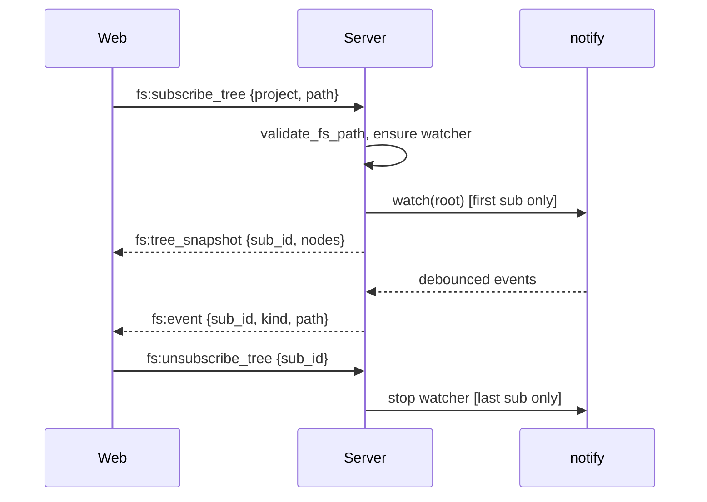

## Goal

Add a VS Code-style three-pane IDE (tree, Monaco, terminal) backed by a server FS subsystem with live watch, full CRUD, and chunked large-file streaming. All file ops flow over the existing WS connection via a new `fs:*` subscription protocol; REST kept only for static endpoints.

## Scope

**In:** server fs module (sandbox, ops, watcher), notify-debouncer-full per workspace, WS subscribe/unsubscribe/snapshot/delta protocol, Monaco editor with tab + viewState, three-pane resizable shell, full CRUD, chunked upload/download, binary detect, large-file fallback viewer, feature flag `features.ide_explorer`.

**Out:** git decorations in tree, search/grep across files, IntelliSense beyond JSON+TS workers, multi-cursor collab, conflict merge UI (last-write-wins documented), mobile-optimized layout.

## Architecture

Single workspace-root recursive watcher (`notify-debouncer-full`, std thread → tokio mpsc → broadcast). `FsSubsystem` (`Arc<Mutex<Inner>>`, mirrors `PtySessionManager`) holds watcher handle + per-project subscriber refcounts. WS connection refactored to writer-task + reader-task pattern; each subscription pumps `broadcast::Receiver` → per-conn bounded `mpsc(512)`. Overflow drops the connection (fs consistency). Sandbox helper canonicalizes + prefix-checks against `workspace_root`. Monaco lives behind a lazy boundary in `IdeShell` route, code-split via `manualChunks`.

## Phase index

| # | File | Status | Effort | Summary |
|---|------|--------|--------|---------|
| 01 | phase-01-server-fs-foundation.md | done (2026-04-08) | 3d | sandbox + ops + read-only REST |
| 02 | phase-02-watcher-ws-protocol.md | done (2026-04-08) | 4d | watcher + WS sub protocol + ws.rs refactor |
| 03 | phase-03-web-ide-shell-readonly.md | done (2026-04-09) | 3d | three-pane shell + react-arborist tree |
| 04 | phase-04-monaco-edit-save.md | done (2026-04-09) | 4d | Monaco + tabs + save + tiering |
| 05 | phase-05-crud-upload-download.md | pending | 4d | mutating ops + chunked transfer |
| 06 | phase-06-atomic-design-refactor.md | done (2026-04-08) | 0.5d | components/ atomic tier cleanup — **merge BEFORE Phase 03** |

## Decisions log

- Transport: WS for all fs ops (subscribe + read + write + upload chunks). REST kept for browser-driven download `<a href>` only. Upload uses WS `fs:upload_*` chunked protocol — no multipart REST path (validated 2026-04-08).
- Sandbox: canonicalize + prefix-check vs `workspace_root` (not cap-std). Symlinks inside root allowed; escapes rejected. Cross-platform via `dunce::canonicalize` (Linux/macOS/Windows supported from day one — validated 2026-04-08).
- Watcher: one shared per workspace root, refcounted, lazy spawn on first sub, shutdown on last unsub.
- WS overflow: drop connection on bounded mpsc Full for fs (consistency); PTY drop-oldest policy preserved.
- Editor: `@monaco-editor/react`, dynamic import, manualChunks split, JSON+TS workers only.
- Tiering: `<1MB` full Monaco, `1–5MB` Monaco degraded, `≥5MB` range-read fallback viewer.
- Conflicts: last-write-wins, documented data-loss risk.
- Tree state: TanStack Query cache + WS-driven setQueryData deltas.
- Tabs: Zustand store, viewState persisted on blur.
- Feature flag: `features.ide_explorer = true` in `dev-hub.toml` or `DEV_HUB_IDE=1` env. Hard cut.
- Backend lifecycle: `FsSubsystem` mirrors `PtySessionManager` `Arc<Mutex<Inner>>`. No locks held across awaits.
- Web components follow atomic design (atoms/molecules/organisms/templates/pages); new IDE components placed in correct tier from day one. See Phase 06 for the structural refactor that lands first.

## Risks (top 5)

1. inotify ENOSPC on large repos → startup probe + actionable error + optional `PollWatcher` fallback.
2. Monaco bundle bloat (~3MB) → lazy boundary, manualChunks, only JSON+TS workers.
3. ws.rs refactor regresses PTY → port PTY paths first behind tests, no behavior change.
4. Last-write-wins data loss → mtime check on save returns `Conflict`; UI shows reload-discard prompt.
5. Symlink TOCTOU → documented, single-user authed assumption; audit log on writes.

## Open questions

- `.gitignore` honoring server-side via `ignore` crate, or client filter? (default: client filter v1)
- fsync-on-save default on or off? (default: off, config knob)
- Multi-root workspace: one sub per project, or one per workspace root? (default: per-project sub, single shared watcher)
- Theme: Monaco `vs-dark` vs custom Tailwind tokens? (default: `vs-dark` v1)
- Mobile breakpoint: hide IDE entirely below 768px? (default: collapse panes, no hide)
- Linux rename correlation via inotify cookie in `debouncer-full` — smoke test required.

## Validation Summary

**Validated:** 2026-04-08
**Questions asked:** 8

### Confirmed Decisions
- **Platform scope:** Windows supported from day one — adds `dunce` crate, Windows path canonicalization, CI matrix. **Diverges from original plan (Linux/macOS only).**
- **WS envelope migration:** Hard cut atomic swap — no dual-parser shim. **Diverges from original plan (one-release shim).** Requires single PR flipping server + web together.
- **Overflow policy:** Asymmetric confirmed — fs=drop-connection (1009), PTY=drop-oldest.
- **Save conflicts:** LWW + mtime check + ConflictDialog confirmed for v1.
- **`.gitignore`:** Client-side filter v1 confirmed.
- **Upload transport:** WS chunking only — **drop REST multipart path entirely.** **Diverges from original plan (REST+WS split).** Browser must hand-roll `FormData` → WS binary frames with ack-per-seq backpressure.
- **Phase 06 ordering:** Separate PR, merges BEFORE Phase 03 confirmed.
- **File tier thresholds:** 1MB / 5MB confirmed.

### Action Items — Plan Revisions Required
- [ ] **Phase 01**: add `dunce = "1"` dep; update `WorkspaceSandbox::validate` to use `dunce::canonicalize` on Windows; add Windows symlink test cases; document CI matrix addition.
- [ ] **Phase 02**: remove migration shim from Step 10; ws_protocol.rs parser accepts new envelope only; coordinate atomic server+web cutover PR.
- [ ] **Phase 03**: update Step 2 to reflect hard cut (no dual-format parser); smoke test must verify terminal paths post-swap in same PR.
- [ ] **Phase 05**: remove REST `POST /api/fs/upload` handler + `packages/web/src/components/organisms/UploadDropzone.tsx` REST path; replace with WS chunked upload (mirror fs:write_begin/chunk/commit pattern with `fs:upload_*` messages); add backpressure via ack-per-seq; update `fs_upload.rs` test to drive WS client; remove `axum::extract::Multipart` from scope.
- [ ] **Phase 05 risks**: add "upload protocol complexity" row — WS chunking replaces browser-native multipart, higher hand-rolled code surface.
- [ ] **plan.md Decisions log**: update transport line — remove "multipart upload also REST" clause.

### Recommendation
**Revise plan first, then proceed to implementation.** Three decisions diverge from recommendations and materially affect Phase 01, 02, 03, 05 scope. Windows support adds ~1-2d; WS-only upload adds ~0.5-1d complexity in Phase 05. Net effort: ~20-21d (was 18.5d).
